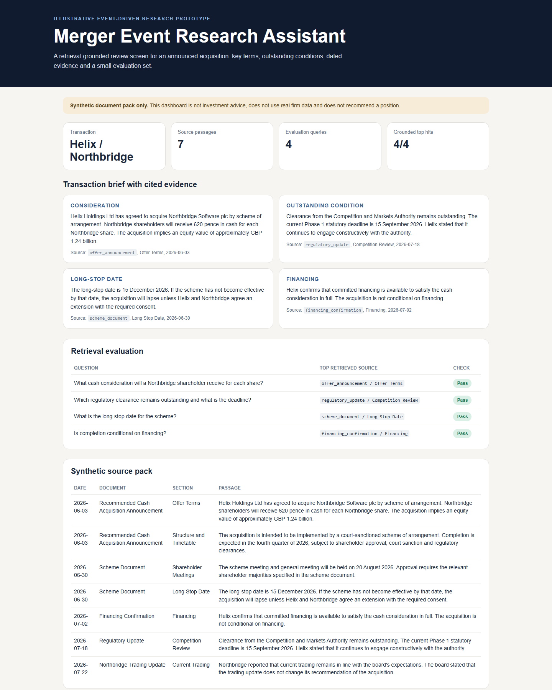

# Merger Event Research Assistant

An illustrative document-retrieval prototype for event-driven equity research. It indexes a synthetic announced-acquisition document pack, surfaces cited answers to core diligence questions and reports whether retrieval returns the expected evidence.

This project uses synthetic deal documents only. It is not connected to any firm or live data source, does not use confidential market data, and does not make investment recommendations.

**Live dashboard:** https://agrawalneel25.github.io/merger-event-research-demo/



## Quick Tour

The dashboard is designed around four questions an analyst might want to answer quickly after an announced transaction:

1. What is the cash consideration?
2. Which condition is still outstanding?
3. What is the long-stop date?
4. Is completion conditional on financing?

For each question, the default view shows the retrieved evidence and its source document. A small evaluation table checks whether each query retrieved the expected synthetic passage and supporting terms.

## Why This Scope

An LLM tool for merger-arbitrage research should not generate unsupported facts. The useful first layer is retrieval and traceability: find the relevant dated passage, attach the citation and expose whether the retrieval step works before asking a model to summarise it.

The deterministic dashboard therefore uses retrieval output directly. An optional Claude API path can answer from the retrieved passages only, with a prompt that prohibits trade recommendations and requires source IDs.

## Run Locally

Requirements: Python 3.10 or later. No third-party packages are required.

```powershell
python -m src.run_demo
start docs\index.html
```

On macOS or Linux:

```bash
python -m src.run_demo
open docs/index.html
```

Expected terminal summary:

```text
Passages indexed: 7
Evaluation queries: 4
Grounded top hits: 4/4
```

## Optional Claude Answers

The dashboard works without an API key. To call Claude for cited JSON answers grounded in the retrieved passages:

```powershell
$env:ANTHROPIC_API_KEY="your-key"
python -m src.run_demo --claude
```

On macOS or Linux:

```bash
export ANTHROPIC_API_KEY="your-key"
python -m src.run_demo --claude
```

The optional integration calls Anthropic's Messages API directly using Python's standard library and defaults to `claude-sonnet-4-6`.

## Test

```powershell
python -m unittest discover -s tests
```

Tests check retrieval accuracy on the four-question evaluation set, brief citations, scope warnings and the optional API-key boundary.

## Structure

```text
data/documents.csv              synthetic dated source passages
data/evaluation_questions.csv   expected retrieval checks
docs/index.html                 generated review dashboard
src/retrieval.py                deterministic passage retrieval
src/evaluation.py               retrieval evaluation
src/brief.py                    cited transaction brief
src/claude.py                   optional grounded Claude answer path
src/report.py                   standalone HTML dashboard
src/run_demo.py                 CLI entry point
tests/                          unit tests
```

## Limitations

- The documents are synthetic and deliberately small; the evaluation does not measure real filing complexity.
- Retrieval is transparent token-based ranking, not an embedding model or production RAG system.
- The optional language-model layer answers from retrieved evidence only and does not assess deal attractiveness, probability of completion or portfolio risk.
